# CONTROLLER - COMPLETE FINAL FLOW

## Overview

The controller uses an event-driven architecture with quality tracking at TWO key points:
1. **BEFORE allocation** - Read avg metrics to calculate priorities
2. **AFTER scraping** - Update avg metrics based on results

---

## Complete Flow Diagram

```
┌────────────────────────────────────────────────────────────────────────────────┐
│                         STEP 0: WATCHDOG (Event Monitor)                       │
│                                                                                │
│  Monitors:                                                                     │
│  • Price WebSocket → 2% change detected → TRIGGER!                            │
│  • News RSS feeds → New article → TRIGGER!                                    │
│  • DB changes → Prediction wrong → TRIGGER!                                   │
│                                                                                │
│  When trigger fires → Calls Step 1                                            │
└────────────────────────────────────────────────────────────────────────────────┘
                                    ↓
┌────────────────────────────────────────────────────────────────────────────────┐
│              STEP 1: QUALITY TRACKER - READ CURRENT METRICS                    │
│                                                                                │
│  Purpose: Get current quality averages from database                          │
│                                                                                │
│  Reads from DB (targets table):                                               │
│  ┌──────────────┬─────────────┬───────────┬──────────┐                       │
│  │ source       │ avg_utility │ avg_noise │ avg_cost │                       │
│  ├──────────────┼─────────────┼───────────┼──────────┤                       │
│  │ Kitco        │ 0.72        │ 0.08      │ 0.85     │                       │
│  │ Reuters      │ 0.45        │ 0.25      │ 1.20     │                       │
│  │ SilverInst   │ 0.60        │ 0.12      │ 0.90     │                       │
│  └──────────────┴─────────────┴───────────┴──────────┘                       │
│                                                                                │
│  These metrics are used for priority calculation in Step 2                    │
└────────────────────────────────────────────────────────────────────────────────┘
                                    ↓
┌────────────────────────────────────────────────────────────────────────────────┐
│                    STEP 2: PRIORITIZER - Calculate Scores                      │
│                                                                                │
│  Uses metrics from Step 1 to calculate priority scores                        │
│                                                                                │
│  Formula: score = (utility / cost) × (1 - noise × 1.5)                        │
│                                                                                │
│  Results:                                                                      │
│  • Kitco:      (0.72/0.85) × (1 - 0.08×1.5) = 0.746 ← HIGHEST                │
│  • SilverInst: (0.60/0.90) × (1 - 0.12×1.5) = 0.547                           │
│  • Reuters:    (0.45/1.20) × (1 - 0.25×1.5) = 0.234 ← LOWEST                 │
│                                                                                │
│  Sources sorted by score (descending)                                         │
└────────────────────────────────────────────────────────────────────────────────┘
                                    ↓
┌────────────────────────────────────────────────────────────────────────────────┐
│                      STEP 3: BUDGET - Allocate API Calls                       │
│                                                                                │
│  Distributes total budget based on priority scores                            │
│                                                                                │
│  Total Budget: 10 API calls                                                   │
│  Total Score: 0.746 + 0.547 + 0.234 = 1.527                                   │
│                                                                                │
│  Allocation:                                                                   │
│  • Kitco:      0.746/1.527 = 49% → 5 calls                                    │
│  • SilverInst: 0.547/1.527 = 36% → 4 calls                                    │
│  • Reuters:    0.234/1.527 = 15% → 1 call                                     │
│                                                                                │
│  Collection Plan created → Forward to Scraper                                 │
└────────────────────────────────────────────────────────────────────────────────┘
                                    ↓
┌────────────────────────────────────────────────────────────────────────────────┐
│                    STEP 4: FRESHNESS CHECK (Before Scraping)                   │
│                                                                                │
│  Hybrid logic checks if data is fresh or stale                                │
│                                                                                │
│  Price Data:                                                                   │
│  • Time threshold: < 60 minutes                                               │
│  • Count threshold: last 10 entries                                           │
│  • Result: 8 fresh, 7 stale                                                   │
│                                                                                │
│  News Data:                                                                    │
│  • Time threshold: < 4 hours                                                  │
│  • Count threshold: last 20 entries                                           │
│  • Result: 5 fresh, 3 stale                                                   │
│                                                                                │
│  Decision: Need fresh data → Proceed with scraping                            │
└────────────────────────────────────────────────────────────────────────────────┘
                                    ↓
┌────────────────────────────────────────────────────────────────────────────────┐
│                         STEP 5: SCRAPER - Execute Collection                   │
│                                                                                │
│  Executes collection plan:                                                     │
│                                                                                │
│  Kitco (5 calls):                                                              │
│  → {title, content, response_time: 1.2s}                                       │
│  → {title, content, response_time: 1.3s}                                       │
│  → ... (5 times)                                                               │
│                                                                                │
│  SilverInst (4 calls):                                                         │
│  → {title, content, response_time: 2.0s}                                       │
│  → ... (4 times)                                                               │
│                                                                                │
│  Reuters (1 call):                                                             │
│  → {title, content, response_time: 4.5s}                                       │
│                                                                                │
│  Saves to DB: price_data, news_data tables                                    │
│  Returns: scrape_results for quality tracking                                 │
└────────────────────────────────────────────────────────────────────────────────┘
                                    ↓
┌────────────────────────────────────────────────────────────────────────────────┐
│           STEP 6: QUALITY TRACKER - CALCULATE THIS SCRAPE'S METRICS            │
│                                                                                │
│  For EACH scrape result, calculate new metrics:                               │
│                                                                                │
│  Kitco Scrape 1:                                                               │
│  ┌──────────────────────────────────────────────────────────────┐             │
│  │ calculate_utility(result):                                   │             │
│  │   • Has content? +0.4                                        │             │
│  │   • Not duplicate? +0.3                                      │             │
│  │   • Substantial (>100 chars)? +0.3                           │             │
│  │   → this_utility = 1.0                                       │             │
│  │                                                              │             │
│  │ calculate_noise(result):                                     │             │
│  │   • Count keywords: "silver", "price", "market"              │             │
│  │   • 3+ keywords → this_noise = 0.1                           │             │
│  │                                                              │             │
│  │ calculate_cost(response_time):                               │             │
│  │   • 1.2 / 10 = 0.12 → this_cost = 0.12                       │             │
│  └──────────────────────────────────────────────────────────────┘             │
│                                                                                │
│  Reuters Scrape 1:                                                             │
│  ┌──────────────────────────────────────────────────────────────┐             │
│  │ • Low quality content → this_utility = 0.4                   │             │
│  │ • Off-topic (no silver keywords) → this_noise = 0.7          │             │
│  │ • Slow (4.5s) → this_cost = 0.45                             │             │
│  └──────────────────────────────────────────────────────────────┘             │
└────────────────────────────────────────────────────────────────────────────────┘
                                    ↓
┌────────────────────────────────────────────────────────────────────────────────┐
│           STEP 7: QUALITY TRACKER - UPDATE ROLLING AVERAGES IN DB              │
│                                                                                │
│  Apply Exponential Moving Average (20% new, 80% old)                          │
│                                                                                │
│  Kitco:                                                                        │
│  ┌────────────────────────────────────────────────────────────────┐           │
│  │ OLD values (from DB):                                          │           │
│  │   avg_utility = 0.72                                           │           │
│  │   avg_noise   = 0.08                                           │           │
│  │   avg_cost    = 0.85                                           │           │
│  │                                                                │           │
│  │ THIS scrape:                                                   │           │
│  │   this_utility = 1.0                                           │           │
│  │   this_noise   = 0.1                                           │           │
│  │   this_cost    = 0.12                                          │           │
│  │                                                                │           │
│  │ NEW values (20% this, 80% old):                                │           │
│  │   new_utility = 0.72×0.8 + 1.0×0.2  = 0.776 ↑                  │           │
│  │   new_noise   = 0.08×0.8 + 0.1×0.2  = 0.084 ↑                  │           │
│  │   new_cost    = 0.85×0.8 + 0.12×0.2 = 0.704 ↓                  │           │
│  │                                                                │           │
│  │ UPDATE targets SET                                             │           │
│  │   avg_utility = 0.776,                                         │           │
│  │   avg_noise = 0.084,                                           │           │
│  │   avg_cost = 0.704                                             │           │
│  │ WHERE id = 'kitco-uuid'                                        │           │
│  └────────────────────────────────────────────────────────────────┘           │
│                                                                                │
│  Reuters:                                                                      │
│  ┌────────────────────────────────────────────────────────────────┐           │
│  │ new_utility = 0.45×0.8 + 0.4×0.2  = 0.44 ↓                      │           │
│  │ new_noise   = 0.25×0.8 + 0.7×0.2  = 0.34 ↑                      │           │
│  │ new_cost    = 1.20×0.8 + 0.45×0.2 = 1.05 ↓                      │           │
│  └────────────────────────────────────────────────────────────────┘           │
│                                                                                │
│  Database updated with new averages!                                          │
└────────────────────────────────────────────────────────────────────────────────┘
                                    ↓
┌────────────────────────────────────────────────────────────────────────────────┐
│                    STEP 8: FRESHNESS - UPDATE & CLEANUP                        │
│                                                                                │
│  After scraping, update freshness status:                                     │
│                                                                                │
│  New entries added:                                                            │
│  • 10 new price entries (from 5+4+1 scrapes)                                  │
│  • 8 new news entries                                                          │
│                                                                                │
│  Freshness re-evaluated:                                                       │
│  • Fresh prices: 10 (all new entries within 60 min)                           │
│  • Fresh news: 8 (all new entries within 4 hours)                             │
│  • Stale prices: 15 (old entries beyond threshold)                            │
│  • Stale news: 0 (all recent)                                                 │
│                                                                                │
│  Optional cleanup:                                                             │
│  DELETE FROM price_data WHERE fetched_at < NOW() - INTERVAL '60 minutes'      │
└────────────────────────────────────────────────────────────────────────────────┘
                                    ↓
┌────────────────────────────────────────────────────────────────────────────────┐
│                         STEP 9: NEXT CYCLE - ADAPTATION                        │
│                                                                                │
│  When watchdog triggers again, new priorities based on updated metrics:       │
│                                                                                │
│  NEW Scores (using updated avg values):                                       │
│  • Kitco:      (0.776/0.704) × (1 - 0.084×1.5) = 0.963 ↑ (was 0.746)         │
│  • SilverInst: (0.60/0.90) × (1 - 0.12×1.5) = 0.547 → (unchanged)             │
│  • Reuters:    (0.44/1.05) × (1 - 0.34×1.5) = 0.205 ↓ (was 0.234)            │
│                                                                                │
│  NEW Allocation:                                                               │
│  • Kitco:      56% → 6 calls ↑ (was 5)                                        │
│  • SilverInst: 32% → 3 calls ↓ (was 4)                                        │
│  • Reuters:    12% → 1 call → (unchanged)                                     │
│                                                                                │
│  ═══════════════════════════════════════════════════════════════               │
│  ║  ALLOCATION ADAPTS BASED ON REAL PERFORMANCE!              ║               │
│  ═══════════════════════════════════════════════════════════════               │
└────────────────────────────────────────────────────────────────────────────────┘
```

---

## Mermaid Diagram - Complete Flow

```mermaid
flowchart TD
    Start([System Running])
    
    subgraph WATCHDOG["🐕 STEP 0: WATCHDOG"]
        W1[Monitor Events]
        W2{Event<br/>Detected?}
        W3[Price Change > 2%<br/>OR New Article<br/>OR Prediction Wrong]
        W1 --> W2
        W2 --> |NO| W1
        W2 --> |YES| W3
    end
    
    Start --> W1
    
    subgraph QT_READ["📈 STEP 1: QUALITY TRACKER - READ"]
        QR1[Read from DB:<br/>targets table]
        QR2[Get avg_utility<br/>avg_noise<br/>avg_cost]
        QR1 --> QR2
    end
    
    W3 --> QR1
    
    subgraph PRIO["📊 STEP 2: PRIORITIZER"]
        P1[Calculate Scores]
        P2["score = (utility/cost)<br/>× (1-noise×1.5)"]
        P3[Sort by Score]
        P1 --> P2 --> P3
    end
    
    QR2 --> P1
    
    subgraph BUDGET["💰 STEP 3: BUDGET"]
        B1[Total: 10 calls]
        B2[Allocate by %]
        B3[Collection Plan]
        B1 --> B2 --> B3
    end
    
    P3 --> B1
    
    subgraph FRESH_CHECK["🧊 STEP 4: FRESHNESS CHECK"]
        F1[Check Price Data]
        F2[Check News Data]
        F3{Data<br/>Fresh?}
        F1 --> F3
        F2 --> F3
        F3 --> |STALE| SCRAPE
        F3 --> |FRESH| SKIP[Skip Scraping]
    end
    
    B3 --> F1
    
    subgraph SCRAPE["🕷️ STEP 5: SCRAPER"]
        S1[Execute API Calls]
        S2[Save to price_data<br/>& news_data]
        S3[Return scrape_results]
        S1 --> S2 --> S3
    end
    
    subgraph QT_CALC["📊 STEP 6: QUALITY TRACKER - CALCULATE"]
        QC1[For each scrape:]
        QC2[calculate_utility<br/>Has content? +0.4<br/>Not duplicate? +0.3<br/>Substantial? +0.3]
        QC3[calculate_noise<br/>Count silver keywords<br/>3+ = 0.1, 0 = 0.7]
        QC4[calculate_cost<br/>response_time / 10]
        QC1 --> QC2
        QC1 --> QC3
        QC1 --> QC4
    end
    
    S3 --> QC1
    
    subgraph QT_UPDATE["📈 STEP 7: QUALITY TRACKER - UPDATE DB"]
        QU1[Read OLD values from DB]
        QU2["Rolling Average:<br/>new = old×0.8 + this×0.2"]
        QU3[UPDATE targets SET<br/>avg_utility, avg_noise, avg_cost]
        QU1 --> QU2 --> QU3
    end
    
    QC2 --> QU1
    QC3 --> QU1
    QC4 --> QU1
    
    subgraph FRESH_UPDATE["🧊 STEP 8: FRESHNESS UPDATE"]
        FU1[Re-evaluate Freshness]
        FU2[Cleanup Stale Data]
        FU1 --> FU2
    end
    
    QU3 --> FU1
    
    subgraph NEXT["🔄 STEP 9: NEXT CYCLE"]
        N1[Watchdog Waits]
        N2[Metrics Updated in DB]
        N3[Next Trigger Uses<br/>NEW Priorities]
        N1 --> N2 --> N3
    end
    
    FU2 --> N1
    N3 --> W1
    
    SKIP --> N1
    
    style WATCHDOG fill:#e1f5fe
    style QT_READ fill:#fff9c4
    style PRIO fill:#e8f5e9
    style BUDGET fill:#fce4ec
    style FRESH_CHECK fill:#e0f7fa
    style SCRAPE fill:#f3e5f5
    style QT_CALC fill:#fff3e0
    style QT_UPDATE fill:#ffecb3
    style FRESH_UPDATE fill:#e0f7fa
    style NEXT fill:#e1f5fe
```



---

## Key Points

### Quality Tracker - Two Phases

1. **BEFORE (Step 1)**: Read avg metrics from DB → Used by prioritizer
2. **AFTER (Step 7)**: Update avg metrics in DB → Used by next cycle

### Adaptive Loop

```
Cycle 1: Default values → Equal allocation
         ↓
Cycle 2: Updated based on Cycle 1 performance → Better sources get more
         ↓
Cycle 3: Updated based on Cycle 2 performance → Continues adapting
         ↓
...
```

### Freshness Logic

- **Fresh**: Used for analysis
- **Stale**: Can be cleaned up
- **Hybrid**: Both time AND count thresholds

---

## Files Involved

| File | Responsibility |
|------|----------------|
| `watchdog.py` | Step 0 - Event detection |
| `quality_tracker.py` | Steps 1, 6, 7 - Read/calculate/update metrics |
| `prioritizer.py` | Step 2 - Score calculation |
| `budget.py` | Step 3 - API call allocation |
| `freshness.py` | Steps 4, 8 - Fresh/stale detection |
| `scheduler.py` | Orchestrates Steps 1-8 |
| Scraper | Step 5 - Data collection |
